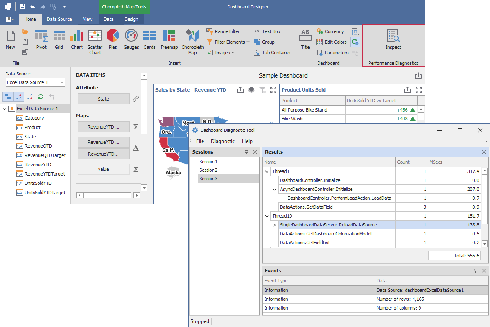

<!-- default badges list -->

<!-- default badges end -->
# Dashboard for WinForms - Inspect the Dashboard Performance

The following example shows how to integrate the Dashboard Diagnostic Tool in the Dashboard Designer to allow users to inspect the dashboard's performance.

## Overview

The **Inspect** button is inserted to the custom Ribbon's **Dashboard Diagnostics** page group. The button click starts a new diagnostic session. The Dashboard Diagnostic Tool monitors user actions to collects actions for each event of the event session. When you uncheck the button, the session is over and the resulting report is automatically saved to the XML file. You can open the report in the Diagnostic Tool UI. 

## Files to Look at

[CS](./CS/DashboardDiagnostis/DesignerForm1.cs) ([VB](./VB/DashboardDiagnostis/DesignerForm1.vb))

## Inspect the Dashboard Performance in the Dashboard Designer

1. Download the [Dashboard Diagnostic Tool](https://github.com/DevExpress-Examples/bi-dashboard-diagnosic-tool). 

2. Reference `DiagnosticTool.dll` and install the [Microsoft.Diagnostics.Tracing.TraceEvent](https://www.nuget.org/packages/Microsoft.Diagnostics.Tracing.TraceEvent/) package in your dashboard project. 

3. Create a custom button and insert it to the Ribbon.

4. Create a `DiagnosticController` object. 

5. Call the conroller's Start() and Stop() methods on button's click to run and finish the Dashboard Diagnostic Tool's session.

6. Implement the `IFileController` interface and specify the output file path in the `TrySaveFile` method. Pass a new class instance that implements `IFileController` to the controller's contructor. 

7. To save the resulting report to the specified output path, call the controller's `Save()` method.

## Documentation

- [Ribbon](https://docs.devexpress.com/Dashboard/15732/winforms-dashboard/winforms-designer/ui-elements-and-customization/ui-elements/ribbon#configure-ribbon-at-runtime)
